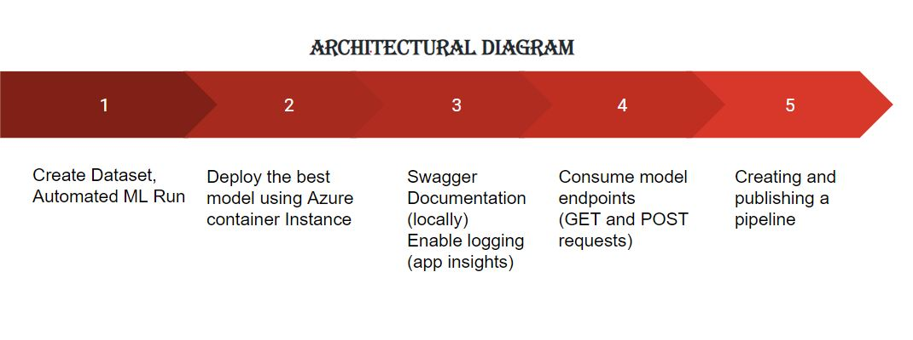

# Operationalizing Machine Learning

This project aims at using Microsoft Azure to configure a cloud-based machine learning production model, deploy it, and consume it and also to create, publish and consume a pipeline using python SDK.
In this project I used the data set containing a Bank's Marketing data that involves a target label of binary classification mentioning whether the customer will do a deposit or not, labelled with the name 'y'. 
 
## Architectural Diagram

## Key Steps
Step 1: register the dataset

I registered the dataset from localfiles after downloading using the URL "https://automlsamplenotebookdata.blob.core.windows.net/automl-sample-notebook-data/bankmarketing_train.csv".

Step 2: Create an AutoML run

I set up an autoML run using the above dataset.

The run generated various models.

The best model found was "VotingEnsemble" with an accuracy of 91.93%.

Step 3: Deploy the best model

Step 4: Insights
Once we deploy the model we should enable the application insights this is done in the logs.py file by service.update(enable_app_sights=True) and executing it.

The log files shown as 
.JPG)

Once we run this we can find an URL in the deployed model providing the app insights

Step 5: Swagger
Swagger is run on the local host
* Get the swagger.json file from the URI available in the deployed model
* Download it into the same directory as the serve.py, swagger.sh files

* Run the shell script and you will find swagger at http://localhost:9000

* open a new git bash and execute the serve.py file 
* Type http://localhost:8000/swagger.json and you will get the deployed model there, along with the GET and POST requests.
DEPLOYED MODEL

GET

POST

Step 6: Endpoint Consumption
We can find the json output by running the endpoint.py file.

Step 7: Creating and publishing pipelines
We need to get the config.json file from the subscription area on the right side corner of the workspace.

## Screen Recording
*TODO* Provide a link to a screen recording of the project in action. Remember that the screencast should demonstrate:

## Standout Suggestions
*TODO (Optional):* This is where you can provide information about any standout suggestions that you have attempted.
